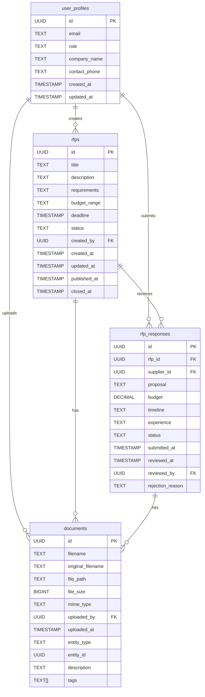

# Database Schema Documentation

## RFP Contract Management System Database

**Project Timeline**: 2 hours  
**Focus**: Core MVP tables and relationships only  

## 🗄️ Database Overview

- **Database**: PostgreSQL (via Supabase)
- **Authentication**: Supabase Auth
- **Storage**: Supabase Storage for file uploads
- **Real-time**: Supabase Realtime for live updates

## 📊 Core Tables

### 1. Users Table

```sql
-- Managed by Supabase Auth
-- Extended with custom profile data
CREATE TABLE public.user_profiles (
  id UUID REFERENCES auth.users(id) PRIMARY KEY,
  email TEXT NOT NULL UNIQUE,
  role TEXT NOT NULL CHECK (role IN ('buyer', 'supplier')),
  company_name TEXT,
  contact_phone TEXT,
  created_at TIMESTAMP WITH TIME ZONE DEFAULT NOW(),
  updated_at TIMESTAMP WITH TIME ZONE DEFAULT NOW()
);

-- Enable RLS (Row Level Security)
ALTER TABLE public.user_profiles ENABLE ROW LEVEL SECURITY;

-- RLS Policies
CREATE POLICY "Users can view their own profile" ON public.user_profiles
  FOR SELECT USING (auth.uid() = id);

CREATE POLICY "Users can update their own profile" ON public.user_profiles
  FOR UPDATE USING (auth.uid() = id);
```

### 2. RFPs Table

```sql
CREATE TABLE public.rfps (
  id UUID DEFAULT gen_random_uuid() PRIMARY KEY,
  title TEXT NOT NULL,
  description TEXT NOT NULL,
  requirements TEXT,
  budget_range TEXT,
  deadline TIMESTAMP WITH TIME ZONE NOT NULL,
  status TEXT NOT NULL DEFAULT 'draft' 
    CHECK (status IN ('draft', 'published', 'closed', 'awarded')),
  created_by UUID NOT NULL REFERENCES public.user_profiles(id),
  created_at TIMESTAMP WITH TIME ZONE DEFAULT NOW(),
  updated_at TIMESTAMP WITH TIME ZONE DEFAULT NOW(),
  published_at TIMESTAMP WITH TIME ZONE,
  closed_at TIMESTAMP WITH TIME ZONE
);

-- Indexes for performance
CREATE INDEX idx_rfps_status ON public.rfps(status);
CREATE INDEX idx_rfps_created_by ON public.rfps(created_by);
CREATE INDEX idx_rfps_deadline ON public.rfps(deadline);

-- Enable RLS
ALTER TABLE public.rfps ENABLE ROW LEVEL SECURITY;

-- RLS Policies
CREATE POLICY "Anyone can view published RFPs" ON public.rfps
  FOR SELECT USING (status = 'published' OR auth.uid() = created_by);

CREATE POLICY "Buyers can create RFPs" ON public.rfps
  FOR INSERT WITH CHECK (
    EXISTS (
      SELECT 1 FROM public.user_profiles 
      WHERE id = auth.uid() AND role = 'buyer'
    )
  );

CREATE POLICY "Buyers can update their own RFPs" ON public.rfps
  FOR UPDATE USING (
    auth.uid() = created_by AND status = 'draft'
  );
```

### 3. RFP Responses Table

```sql
CREATE TABLE public.rfp_responses (
  id UUID DEFAULT gen_random_uuid() PRIMARY KEY,
  rfp_id UUID NOT NULL REFERENCES public.rfps(id) ON DELETE CASCADE,
  supplier_id UUID NOT NULL REFERENCES public.user_profiles(id),
  proposal TEXT NOT NULL,
  budget DECIMAL(12,2),
  timeline TEXT,
  experience TEXT,
  status TEXT NOT NULL DEFAULT 'submitted' 
    CHECK (status IN ('submitted', 'under_review', 'approved', 'rejected')),
  submitted_at TIMESTAMP WITH TIME ZONE DEFAULT NOW(),
  reviewed_at TIMESTAMP WITH TIME ZONE,
  reviewed_by UUID REFERENCES public.user_profiles(id),
  rejection_reason TEXT,
  
  -- Ensure one response per supplier per RFP
  UNIQUE(rfp_id, supplier_id)
);

-- Indexes
CREATE INDEX idx_rfp_responses_rfp_id ON public.rfp_responses(rfp_id);
CREATE INDEX idx_rfp_responses_supplier_id ON public.rfp_responses(supplier_id);
CREATE INDEX idx_rfp_responses_status ON public.rfp_responses(status);

-- Enable RLS
ALTER TABLE public.rfp_responses ENABLE ROW LEVEL SECURITY;

-- RLS Policies
CREATE POLICY "Suppliers can view their own responses" ON public.rfp_responses
  FOR SELECT USING (auth.uid() = supplier_id);

CREATE POLICY "Buyers can view responses to their RFPs" ON public.rfp_responses
  FOR SELECT USING (
    EXISTS (
      SELECT 1 FROM public.rfps 
      WHERE id = rfp_id AND created_by = auth.uid()
    )
  );

CREATE POLICY "Suppliers can create responses to published RFPs" ON public.rfp_responses
  FOR INSERT WITH CHECK (
    EXISTS (
      SELECT 1 FROM public.rfps 
      WHERE id = rfp_id AND status = 'published'
    ) AND
    EXISTS (
      SELECT 1 FROM public.user_profiles 
      WHERE id = auth.uid() AND role = 'supplier'
    )
  );

CREATE POLICY "Buyers can update responses to their RFPs" ON public.rfp_responses
  FOR UPDATE USING (
    EXISTS (
      SELECT 1 FROM public.rfps 
      WHERE id = rfp_id AND created_by = auth.uid()
    )
  );
```

### 4. Documents Table

```sql
CREATE TABLE public.documents (
  id UUID DEFAULT gen_random_uuid() PRIMARY KEY,
  filename TEXT NOT NULL,
  original_filename TEXT NOT NULL,
  file_path TEXT NOT NULL,
  file_size BIGINT NOT NULL,
  mime_type TEXT NOT NULL,
  uploaded_by UUID NOT NULL REFERENCES public.user_profiles(id),
  uploaded_at TIMESTAMP WITH TIME ZONE DEFAULT NOW(),
  
  -- Polymorphic relationship
  entity_type TEXT NOT NULL CHECK (entity_type IN ('rfp', 'response', 'profile')),
  entity_id UUID NOT NULL,
  
  -- Metadata
  description TEXT,
  tags TEXT[]
);

-- Indexes
CREATE INDEX idx_documents_entity ON public.documents(entity_type, entity_id);
CREATE INDEX idx_documents_uploaded_by ON public.documents(uploaded_by);

-- Enable RLS
ALTER TABLE public.documents ENABLE ROW LEVEL SECURITY;

-- RLS Policies
CREATE POLICY "Users can view documents they uploaded" ON public.documents
  FOR SELECT USING (auth.uid() = uploaded_by);

CREATE POLICY "Users can view documents related to accessible entities" ON public.documents
  FOR SELECT USING (
    -- RFP documents: accessible if RFP is published or user is creator
    (entity_type = 'rfp' AND EXISTS (
      SELECT 1 FROM public.rfps 
      WHERE id = entity_id AND (status = 'published' OR created_by = auth.uid())
    )) OR
    -- Response documents: accessible if user is supplier or RFP creator
    (entity_type = 'response' AND EXISTS (
      SELECT 1 FROM public.rfp_responses r 
      JOIN public.rfps rf ON r.rfp_id = rf.id
      WHERE r.id = entity_id AND (r.supplier_id = auth.uid() OR rf.created_by = auth.uid())
    ))
  );

CREATE POLICY "Users can upload documents" ON public.documents
  FOR INSERT WITH CHECK (auth.uid() = uploaded_by);
```

## 🔗 Table Relationships



## 📋 Database Functions

### 1. Update Timestamps

```sql
-- Function to automatically update updated_at timestamp
CREATE OR REPLACE FUNCTION update_updated_at_column()
RETURNS TRIGGER AS $$
BEGIN
    NEW.updated_at = NOW();
    RETURN NEW;
END;
$$ language 'plpgsql';

-- Triggers for updated_at
CREATE TRIGGER update_rfps_updated_at 
    BEFORE UPDATE ON public.rfps 
    FOR EACH ROW EXECUTE FUNCTION update_updated_at_column();

CREATE TRIGGER update_user_profiles_updated_at 
    BEFORE UPDATE ON public.user_profiles 
    FOR EACH ROW EXECUTE FUNCTION update_updated_at_column();
```

### 2. RFP Status Management

```sql
-- Function to publish RFP
CREATE OR REPLACE FUNCTION publish_rfp(rfp_uuid UUID)
RETURNS BOOLEAN AS $$
BEGIN
    UPDATE public.rfps 
    SET status = 'published', published_at = NOW()
    WHERE id = rfp_uuid 
    AND created_by = auth.uid() 
    AND status = 'draft';
    
    RETURN FOUND;
END;
$$ LANGUAGE plpgsql SECURITY DEFINER;

-- Function to close RFP
CREATE OR REPLACE FUNCTION close_rfp(rfp_uuid UUID)
RETURNS BOOLEAN AS $$
BEGIN
    UPDATE public.rfps 
    SET status = 'closed', closed_at = NOW()
    WHERE id = rfp_uuid 
    AND created_by = auth.uid() 
    AND status = 'published';
    
    RETURN FOUND;
END;
$$ LANGUAGE plpgsql SECURITY DEFINER;
```

## 🔒 Security Features

### Row Level Security (RLS)

- All tables have RLS enabled
- Policies ensure users can only access data they're authorized to see
- Role-based access control at the database level

### Data Validation

- Check constraints ensure data integrity
- Foreign key relationships maintain referential integrity
- Unique constraints prevent duplicate data

### Audit Trail

- `created_at` and `updated_at` timestamps on all tables
- User tracking for all data modifications
- Document upload tracking with metadata

## 📊 Performance Considerations

### Indexes

- Primary keys are automatically indexed
- Foreign key columns are indexed for join performance
- Status and date columns are indexed for filtering

### Query Optimization

- Use appropriate WHERE clauses to leverage indexes
- Implement pagination for large result sets
- Consider materialized views for complex aggregations

## 🚀 Migration Strategy

### Phase 1: Core Tables (30 min)

1. Create user_profiles table
2. Create rfps table
3. Set up basic RLS policies

### Phase 2: Response System (30 min)

1. Create rfp_responses table
2. Implement response workflow
3. Add response-related policies

### Phase 3: Document Management (30 min)

1. Create documents table
2. Set up file storage integration
3. Implement document access policies

### Phase 4: Polish & Testing (30 min)

1. Add database functions
2. Test RLS policies
3. Optimize queries and indexes

## 📝 Notes

- All UUIDs use `gen_random_uuid()` for security
- Timestamps are in UTC with timezone information
- File size is stored in bytes (BIGINT)
- Tags are stored as PostgreSQL arrays for flexibility
- RLS policies are the primary security mechanism

---

**Last Updated**: December 2024  
**Version**: 1.0.0-alpha  
**Timeline**: 2 Hours MVP
